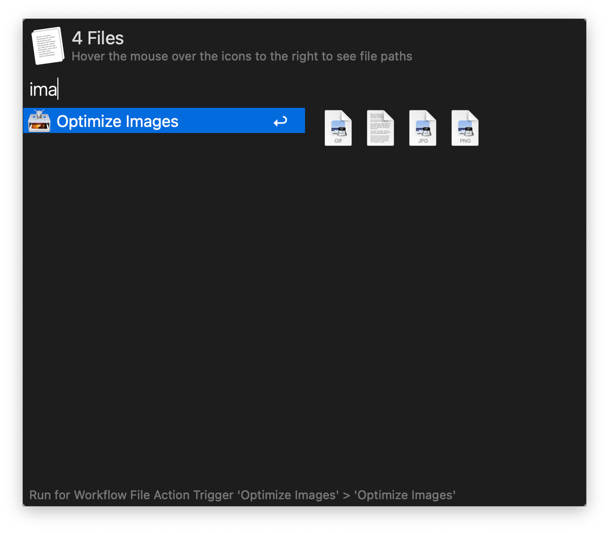

# Alfred ImageOptim Workflow

[](https://github.com/AlexanderWillner/imageoptim-alfred-workflow/releases)

[ImageOptim](https://imageoptim.com/mac) removes bloated metadata. Saves disk space & bandwidth by compressing images without losing quality.

## Usage

To activate this workflow invoke your hotkey for ```Universal Actions``` on a folder, JPG, PNG, GIF, or SVG file. Then select ```Optimize Images```.



After a few seconds the image(s) should be compressed.

## Caveats

Please note that [ImageOptim](https://imageoptim.com/mac) or related tools should be installed (e.g. via [brew](https://brew.sh)). Binaries that will be used (if installed):

* JPEG: `jpegtran`, `jpegoptim`
* GIF: `gifsicle`
* SVG: `svgcleaner`
* PNG: `pngcrush`, `advpng`, `oxipng`, `pngquant`, `zopflipng`, `pngout`

## Installing the Workflow

1. Simply download the [last release](https://github.com/AlexanderWillner/imageoptim-alfred-workflow/releases)
2. Unzip the file on your computer
3. Install `imageoptim.alfredworkflow` by double-clicking the workflow file and clicking on "Import".

You'll now see the workflow listed in the left sidebar of your Workflows preferences pane.

## Command Line

```bash
$ ./bin/imageoptim workflow/icon.png
Starting...
Optimizing workflow/icon.png with pngcrush...
Optimizing workflow/icon.png with advpng...
Optimizing workflow/icon.png with oxipng...
File already optimized
Optimizing workflow/icon.png with pngquant...
Optimizing workflow/icon.png with zopflipng...
Optimizing workflow/icon.png
Input size: 20875 (20K)
Result size: 20266 (19K). Percentage of original: 97.083%
Result is smaller

Optimizing workflow/icon.png with pngout...
Done.
```

## Details

To create a modified version of the workflow, edit the files and run ```make workflow``` to create an updated workflow.

## Disclaimer

This package has been inspired by [ramiroaraujo's Image Optim Alfred Workflow](https://github.com/ramiroaraujo/alfred-image-optim-workflow).
